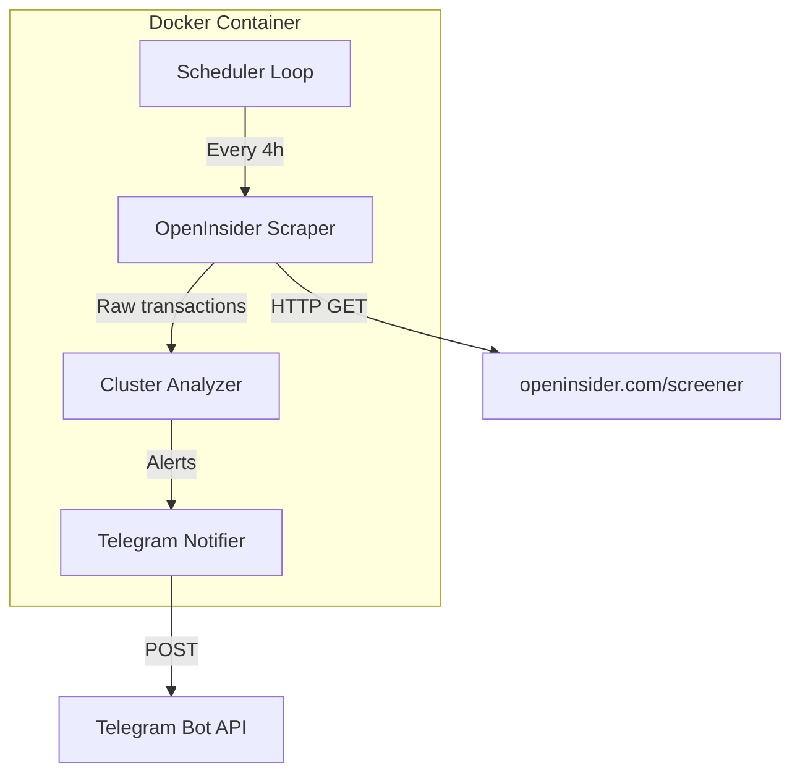

# OpenInsider Telegram Alert System

## Architecture Overview




## Data Flow

1. **Scraper** fetches the screener page with date range (e.g. last 7 days) and parses the HTML table
2. **Analyzer** groups transactions by company (ticker), filters by min value (200k), and checks if 3+ distinct executives qualify
3. **Notifier** sends a formatted Telegram message for each qualifying company
4. **Deduplication** stores last alert hashes to avoid duplicate notifications on subsequent polls

## Technical Approach

### Scraping Strategy

OpenInsider has no public API. We will scrape the screener page using the same approach as [openinsiderData](https://github.com/sd3v/openinsiderData):

- **URL**: `http://openinsider.com/screener?s=&o=&pl=&ph=&ll=&lh=&fd=-1&fdr={start_date}+-+{end_date}&td=0&tdr=&...&vl=200&vh=&...&cnt=5000&page=1`
- **Parameters**: `vl=200` sets minimum value to 200 (displayed in thousands, so 200 = $200k)
- **Table**: Parse `<table class="tinytable">` with BeautifulSoup
- **Columns**: Filing Date, Trade Date, Ticker, Company Name, Insider Name, Title, Trade Type, Price, Qty, Owned, Value

**Note**: OpenInsider may return 503 under bot detection. Mitigations: User-Agent rotation, request delays, and optionally using SEC EDGAR as a fallback (more complex).

### Detection Logic

For each company (ticker):

1. Filter transactions: `Value >= 200000` AND `transaction_type` in `['P', 'S']` (Purchase, Sale)
2. Group by insider (owner_name) and sum their qualifying transaction values
3. If `count(distinct executives) >= 3`: **ALERT**
4. Message content: company name, ticker, executive count, per-executive amounts, total

### Configuration (Environment Variables)


| Variable                | Default    | Description                     |
| ----------------------- | ---------- | ------------------------------- |
| `POLL_INTERVAL_HOURS`   | 4          | Hours between scrapes           |
| `MIN_EXECUTIVES`        | 3          | Minimum executives for alert    |
| `MIN_TRANSACTION_VALUE` | 200000     | Min value per transaction (USD) |
| `LOOKBACK_DAYS`         | 7          | Days of data to fetch per poll  |
| `TELEGRAM_BOT_TOKEN`    | (required) | Bot token from @BotFather       |
| `TELEGRAM_CHAT_ID`      | (required) | Your chat ID                    |


## Project Structure

```
openinsider/
├── Dockerfile
├── docker-compose.yml
├── requirements.txt
├── config.py              # Load env vars
├── scraper.py             # Fetch & parse openinsider
├── analyzer.py            # Cluster detection logic
├── telegram_notifier.py   # Send messages
├── main.py                # Scheduler loop + orchestration
├── .env.example           # Template for secrets
└── README.md
```

## Key Implementation Details

### Scraper ([scraper.py](scraper.py))

- Use `requests` + `BeautifulSoup` (same as openinsiderData)
- Set `User-Agent` to a browser string to reduce 503 risk
- Parse `tinytable` tbody rows; extract: ticker, company_name, owner_name, transaction_type, Value
- Value format: `$1,234` or `$1.23M` — parse both
- Retry with exponential backoff on 503/network errors

### Analyzer ([analyzer.py](analyzer.py))

- Input: list of transaction dicts
- Group by `(ticker, company_name)`
- Per company: filter `value >= MIN`, type in P/S
- Per executive: sum their qualifying transaction values
- Return list of `{ticker, company_name, executives: [{name, total_value}], total_value}` where `len(executives) >= MIN_EXECUTIVES`

### Deduplication

- Persist last alert IDs (e.g. `ticker + date_range + hash(executives)`) to a JSON file or SQLite
- Only send Telegram if alert is new
- Optional: TTL to re-alert after 24h if same cluster persists

### Telegram Message Format

```
🔔 Insider Cluster Alert

Company: Apple Inc. (AAPL)
Executives: 4

• Tim Cook (CEO): $2,450,000
• Luca Maestri (CFO): $890,000
• Jeff Williams (COO): $1,200,000
• Kate Adams (General Counsel): $320,000

Total: $4,860,000
```

## Docker Setup

- **Base image**: `python:3.11-slim`
- **Run**: `python main.py` in loop with `time.sleep(POLL_INTERVAL_HOURS * 3600)`
- **Volumes**: Optional persistence for dedup state
- **Environment**: Pass all config via env (no secrets in image)

## Dependencies

```
requests>=2.31.0
beautifulsoup4>=4.12.0
python-dotenv>=1.0.0
```

## User Setup Required

1. Create Telegram bot via [@BotFather](https://t.me/BotFather), get token
2. Get chat ID (e.g. message your bot, then call `getUpdates` or use @userinfobot)
3. Create `.env` with `TELEGRAM_BOT_TOKEN` and `TELEGRAM_CHAT_ID`
4. Run: `docker compose up -d`

## Edge Cases

- **503 errors**: Log and retry; consider adding `curl_cffi` or Playwright for stricter sites
- **Value parsing**: Handle `$1.23M` (multiply by 1e6), `$1,234` (strip commas)
- **Same executive, multiple transactions**: Sum per executive before counting
- **EUR vs USD**: OpenInsider uses USD. For EUR, add optional `CURRENCY` env and exchange rate API (e.g. exchangerate-api.com) — can be phase 2

