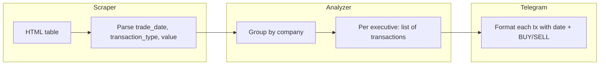

# Add Date/Time and Buy/Sell Labels to Telegram Alerts

## Current State

- **Scraper** ([scraper.py](scraper.py)): Parses `filing_date` and `trade_date` from the HTML table but does **not** include them in the output transaction dict (lines 157-165). Only `ticker`, `company_name`, `owner_name`, `title`, `transaction_type`, and `value` are passed.
- **Analyzer** ([analyzer.py](analyzer.py)): Aggregates per executive (name, title, total_value) and drops individual transaction details (date, type).
- **Telegram notifier** ([telegram_notifier.py](telegram_notifier.py)): Shows per-executive totals only; no per-transaction breakdown, dates, or buy/sell labels.

## Data Flow (after changes)




## Implementation

### 1. Scraper: Include trade_date in transactions

In [scraper.py](scraper.py), add `trade_date` to the transaction dict (around line 157):

```python
transactions.append({
    ...
    "trade_date": data.get("trade_date", ""),  # e.g. "03/10/2025" or "2025-03-10"
    ...
})
```

Add a small helper to parse/normalize the date string for display (handle common formats like `MM/DD/YYYY` and `YYYY-MM-DD`). If the source has no time, use date only (e.g. `2025-03-10`).

### 2. Analyzer: Preserve per-transaction details per executive

In [analyzer.py](analyzer.py), change the executive structure from `{name, title, total_value}` to include a list of transactions:

```python
# Per executive, store: name, title, total_value, transactions
# Each transaction: {trade_date, transaction_type, value}
```

- Keep `total_value` for the summary.
- Add `transactions: [{trade_date, transaction_type, value}, ...]` per executive.
- Sort transactions by date (newest first) for readability.

### 3. Telegram notifier: Format each transaction with date and BUY/SELL

In [telegram_notifier.py](telegram_notifier.py), update `format_alert_message`:

- Map `transaction_type`: `"P"` → **BUY**, `"S"` → **SELL** (per `PURCHASE_SALE_TYPES` in analyzer).
- For each executive, show their total, then list each transaction with:
  - Formatted date (and time if available)
  - Explicit **BUY** or **SELL** label
  - Value

Example output:

```
• John Doe (CEO): $1.2M total
  - 2025-03-10: BUY $500k
  - 2025-03-08: SELL $700k
```

### 4. Commit and push

- Stage changed files: `scraper.py`, `analyzer.py`, `telegram_notifier.py`
- Commit with message: `Add date/time and BUY/SELL labels to Telegram alerts`
- Push to remote

## Files to Modify


| File                                         | Changes                                                                              |
| -------------------------------------------- | ------------------------------------------------------------------------------------ |
| [scraper.py](scraper.py)                     | Add `trade_date` to transaction dict                                                 |
| [analyzer.py](analyzer.py)                   | Add `transactions` list per executive with `trade_date`, `transaction_type`, `value` |
| [telegram_notifier.py](telegram_notifier.py) | Format each transaction with date and BUY/SELL label                                 |


## Note on Time

OpenInsider typically provides trade date but not always time. The plan uses the available date; if time is present in the scraped data, it will be included in the formatted output.