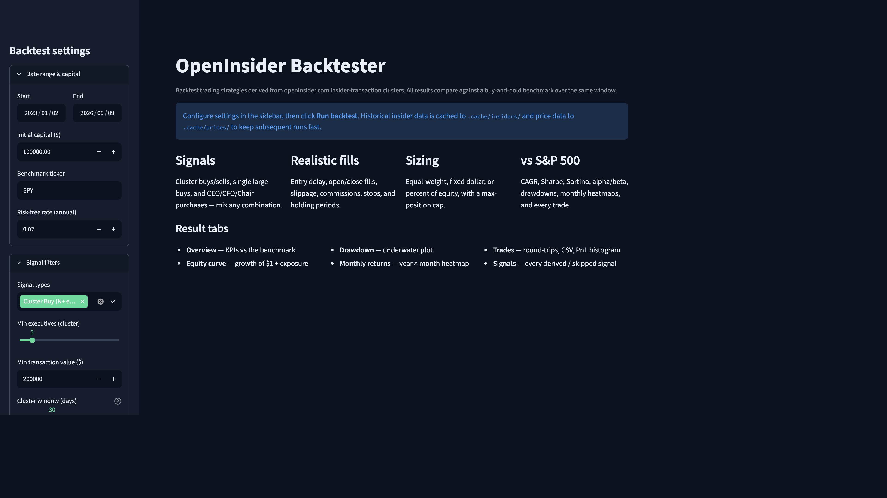
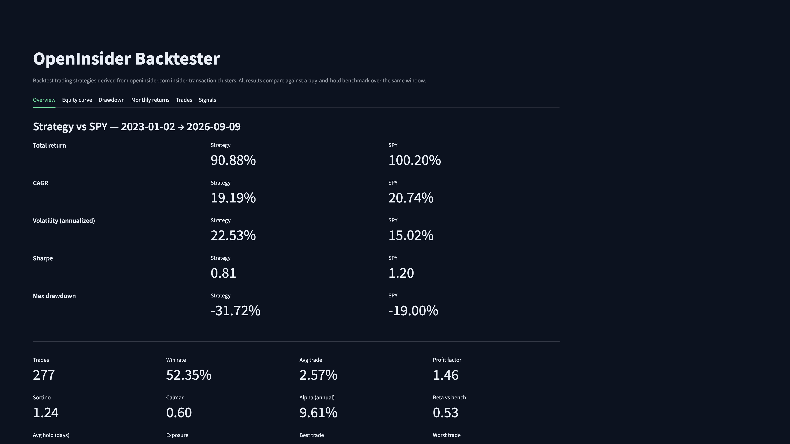
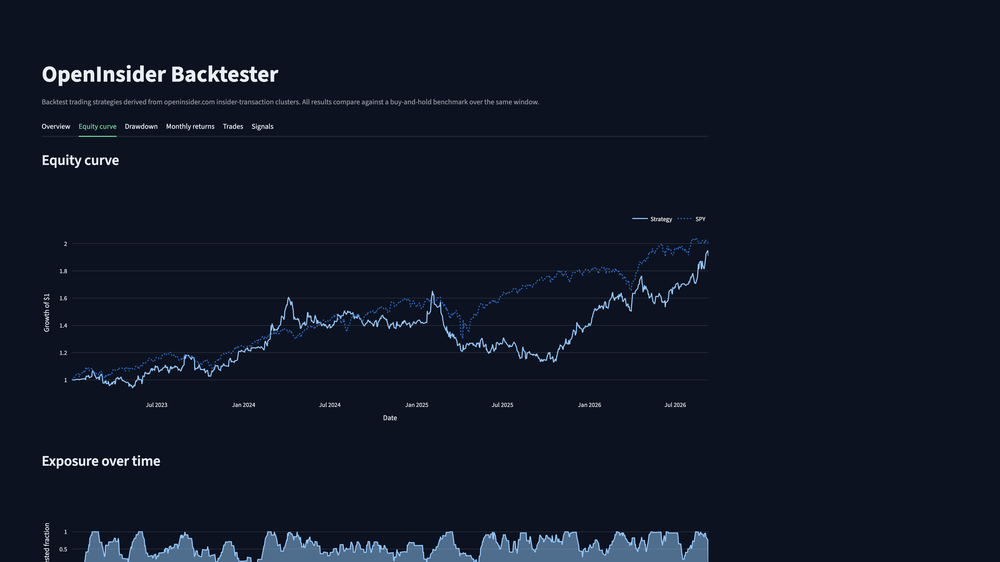
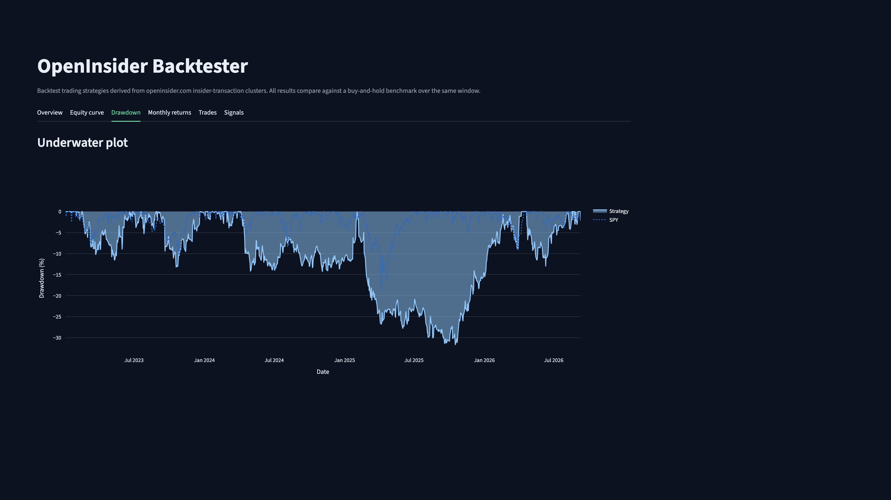
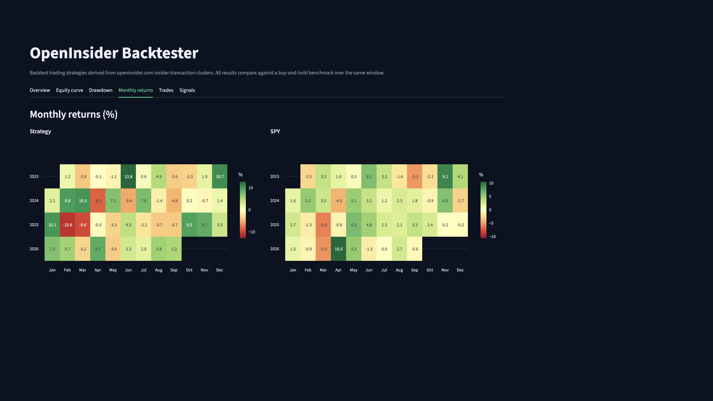
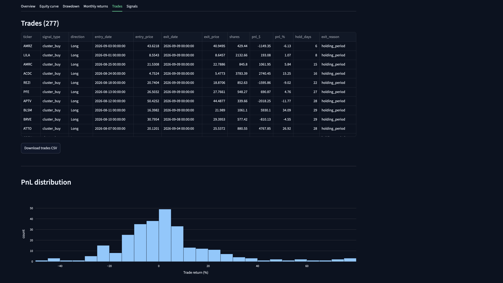
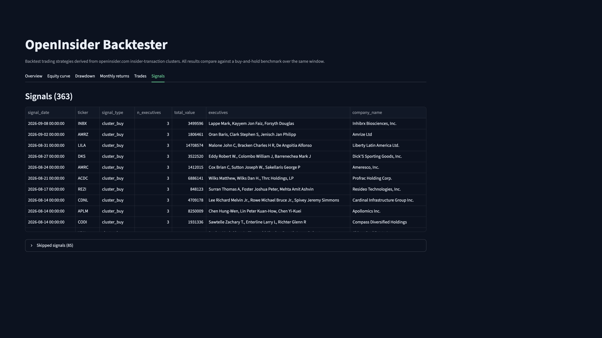

# OpenInsider Telegram Alert + Backtester

Two tools that share one scraper:

1. **Telegram notifier** — polls [openinsider.com](https://openinsider.com) every few hours. When 3+ executives at a company each buy/sell shares worth at least $200k, you get a Telegram alert.
2. **Backtesting web app** — Streamlit UI that replays historical openinsider signals against configurable strategy rules and compares equity vs. the S&P 500.



---

## Backtesting web app

Configure signal filters, fills, sizing, and exits in the sidebar, then run. Results land in six tabs: overview KPIs, equity curve, drawdown, monthly heatmap, every round-trip, and every derived signal.

```bash
pip install -r requirements.txt
streamlit run backtest_app.py
```

Open http://localhost:8501.

Or with Docker:

```bash
docker compose --profile backtest up -d backtest
```

Caches persist in the `backtest_cache` volume (or locally in `.cache/insiders/` and `.cache/prices/`).

### What you can configure

| Group | Setting | Notes |
|-------|---------|-------|
| **Range** | Start / End date, initial capital, benchmark ticker, risk-free rate | Default window is the last 3 years. |
| **Signal filters** | Signal types, min executives, min transaction value, cluster window, single-large-buy threshold | Mix cluster buys/sells, single large buys, and CEO/CFO/Chair buys. |
| **Entry** | Entry delay (days after signal), fill at open/close, slippage bps, commission bps | Entry delay defaults to 1 day to model “you see it after close”. |
| **Sizing** | Equal-weight / fixed $ / percent-of-equity, max concurrent positions, overflow (skip or replace-oldest) | Equal-weight splits capital across `max_positions` slots. |
| **Exits** | Holding period (trading days), stop-loss %, take-profit %, trailing stop % | Any combination; first trigger wins. |
| **Advanced** | Short on cluster-sell signals | Simulated only, no borrow fees modeled. |

### Sample results

Featured run (the screenshots below):

- **Window:** 2 Jan 2023 → 9 Sep 2026
- **Universe:** 9,466 insider transactions ≥ $200k across 2,582 tickers
- **Signal:** cluster buy — 3+ executives, each ≥ $200k, 30-day window → **363 signals**
- **Portfolio:** $100k start, equal-weight, max 10 positions, 20-day hold
- **Costs:** enter next-day open, 5 bps slippage, 1 bps commission per side
- **Benchmark:** buy-and-hold SPY

| | Strategy | SPY |
|---|---:|---:|
| Total return | **+90.9%** | +100.2% |
| CAGR | 19.2% | 20.7% |
| Sharpe | 0.81 | 1.20 |
| Sortino | 1.24 | — |
| Max drawdown | −31.7% | −19.0% |
| Alpha (annual) | **+9.6%** | — |
| Beta vs SPY | 0.53 | 1.00 |
| Trades / win rate | 277 / 52.4% | — |
| Profit factor | 1.46 | — |
| Avg trade | +2.6% | — |
| Exposure | 60% | 100% |
| Final equity | $190,876 | $198,351 |

Cluster buys did not beat a roaring S&P 500 over this window, but they did it with about half the market beta and positive alpha. Tightening the cluster or stretching the hold changed the picture (same start date; variants run through 1 Sep 2026):

| Variant | Trades | Win rate | Total return | CAGR | Sharpe | Max DD | Profit factor |
|---------|-------:|---------:|-------------:|-----:|-------:|-------:|--------------:|
| **3+ execs, 20-day hold** (featured) | 277 | 52% | +91% | 19.2% | 0.81 | −32% | 1.46 |
| 3+ execs, 60-day hold, 10% stop | 223 | 32% | +29% | 7.3% | 0.33 | −31% | 1.19 |
| 4+ execs, 40-day hold | 111 | 54% | +52% | 12.1% | 0.52 | −29% | 1.48 |
| SPY buy-and-hold | — | — | +100% | 20.7% | 1.20 | −19% | — |

The 60-day hold plus a 10% stop cut winners short and dropped the win rate. Requiring a fourth executive traded less often and still lagged SPY.













### Result tabs

- **Overview** — Total return, CAGR, Sharpe, Sortino, max DD, alpha/beta, trade stats, side-by-side with the benchmark.
- **Equity curve** — Strategy vs benchmark (growth of $1), plus an exposure chart.
- **Drawdown** — Underwater plot for both.
- **Monthly returns** — Year-by-month heatmap for both.
- **Trades** — Every round-trip with entry/exit prices, P&L, hold days, exit reason; CSV download; PnL histogram; exit-reason bar chart.
- **Signals** — Every derived signal and any skipped signals (with reasons).

### Caching

- Insider transactions are cached per month to `.cache/insiders/<start>_<end>_<minvalue>.parquet`. Only fully-historical chunks are cached.
- Prices are cached per ticker to `.cache/prices/<TICKER>.parquet` and extended on demand.
- Use **Clear cache** in the sidebar to wipe both.

---

## Telegram notifier

### 1. Create a Telegram Bot

1. Message [@BotFather](https://t.me/BotFather) on Telegram
2. Send `/newbot` and follow the prompts
3. Copy the bot token you receive

### 2. Get Your Chat ID

1. Send a message to your new bot
2. Visit `https://api.telegram.org/bot<YOUR_TOKEN>/getUpdates`
3. Find `"chat":{"id":123456789}` in the JSON response
4. Or use [@userinfobot](https://t.me/userinfobot) to get your ID

### 3. Configure

```bash
cp .env.example .env
# Edit .env and add your TELEGRAM_BOT_TOKEN and TELEGRAM_CHAT_ID
```

### 4. Run with Docker

```bash
docker compose up -d
```

Or run locally:

```bash
pip install -r requirements.txt
python main.py
```

### Configuration

| Variable | Default | Description |
|----------|---------|-------------|
| `POLL_INTERVAL_HOURS` | 4 | Hours between scrapes |
| `MIN_EXECUTIVES` | 3 | Minimum executives for alert |
| `MIN_TRANSACTION_VALUE` | 200000 | Min value per transaction (USD) |
| `LOOKBACK_DAYS` | 7 | Days of data to fetch per poll |
| `TELEGRAM_BOT_TOKEN` | (required) | Bot token from @BotFather |
| `TELEGRAM_CHAT_ID` | (required) | Your chat ID |

### Alert Format

```
🔔 Insider Cluster Alert

Company: Apple Inc. (AAPL)
Executives: 4

• Tim Cook (CEO): $2.45M total
  - 2024-03-15: BUY $2.45M
• Luca Maestri (CFO): $890,000 total
  - 2024-03-14: BUY $890,000
• Jeff Williams (COO): $1.20M total
  - 2024-03-12: BUY $1.20M
• Kate Adams (General Counsel): $320,000 total
  - 2024-03-11: BUY $320,000

Total: $4.86M
```

### Deduplication

Alerts are deduplicated: the same cluster (company + executives) won't trigger another notification for 24 hours.

---

## Disclaimer

For educational purposes. Ensure you comply with openinsider.com's terms of service and local regulations when using scraped data. Backtest results are not predictive of live performance; insider-trade timestamps on openinsider reflect *filing* dates, not necessarily realistic entry timing.
